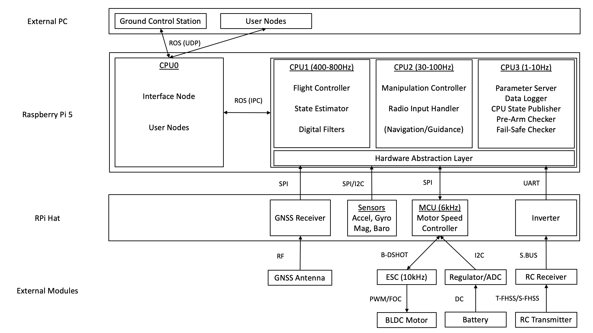
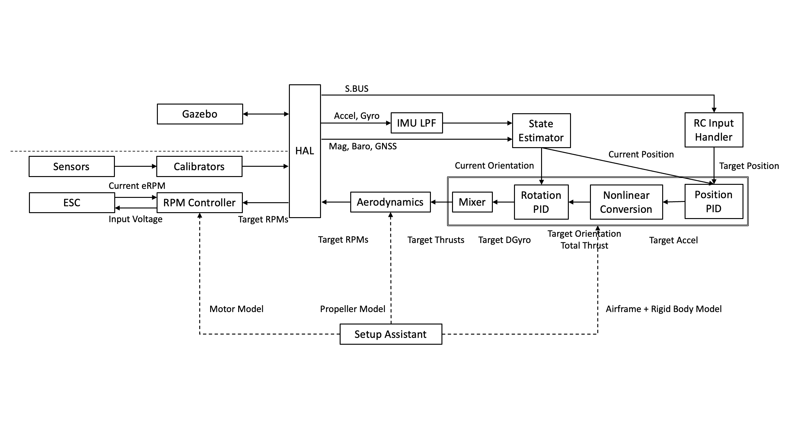

# System Architecture

This section provides an overview of the Tobas system architecture, divided into hardware and software.

## Hardware Architecture

---

The diagram below shows the hardware architecture.
Sensor data sent from the HAT via serial communication is converted into standard ROS messages by the hardware abstraction layer (Hardware Abstraction Layer, hereafter HAL) on the RPi, and then processed by the flight code running on CPU1-3.
The target motor speeds output by the flight code pass through the HAL again and are sent to the motor speed control MCU on the HAT, which calculates throttle commands and sends them to the ESCs via digital communication.
On CPU0, an interface node for remote communication runs in a separate process from the flight code.
All remote access to the flight controller, including access from a ground station, must pass through this node.
Communication processes and CPU cores are separated in this way to ensure the real-time performance of the flight code and prevent unexpected behavior.

## Software Architecture

---

The diagram below shows the software architecture.
Sensor data from a physical vehicle or a vehicle in Gazebo is converted into standard ROS messages by the HAL.
The sensor data is sent to the state estimator, which estimates the vehicle's position, attitude, velocity, and angular velocity.
The estimated state is sent to the controllers enclosed by the double border in the diagram, where the target thrust for each propeller is calculated.
The target motor speed is calculated from the target thrust according to the propeller model.
The target speeds pass through the HAL again and are then sent as commands to the physical vehicle or the vehicle in Gazebo.
For a physical vehicle, the motor controller on the MCU calculates the voltage to apply to each motor from the target speeds and sends the commands to the ESCs.
The vehicle's physical model required by the flight and motor controllers is obtained from the Tobas project created with the [Setup Assistant](../getting_started/airframe_config.md).

