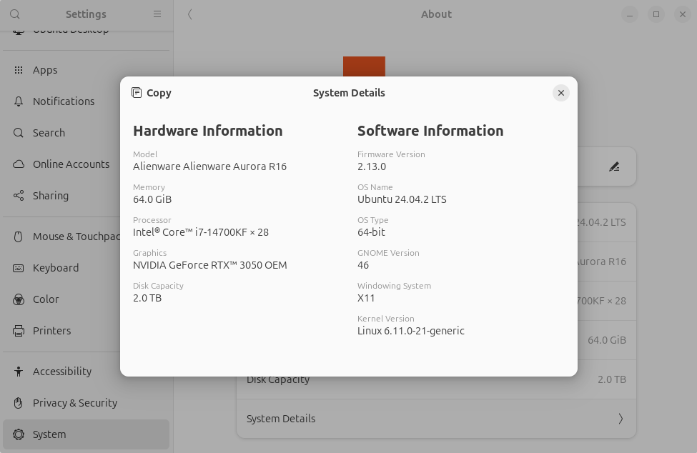

# Troubleshooting

This section summarizes known issues and their solutions.

## Gazebo is running slowly

---

### 1. The display server may not be set to X11

From `Settings / System / About / System Details`, confirm that the display server is set to X11.



If it is not X11—for example, if it shows Wayland—select your username on the Ubuntu login screen, click the gear icon in the lower-right corner, and select the display server as follows:

- If `Ubuntu` or `Ubuntu on Wayland` is available → `Ubuntu`
- If `Ubuntu on Xorg` or `Ubuntu` is available → `Ubuntu on Xorg`

## ROS communication between the FC and PC is not working

---

### 1. The firewall may be blocking UDP

ROS 2 uses UDP for network communication, but the firewall may not allow it.
Check the firewall status with the following command.
If the list of allowed ports does not include UDP ports in the 7400 range, this may be the cause.

```bash
$ sudo ufw status
```

Ideally, only the required ports should be allowed.
For now, disabling UFW and rebooting should enable communication.

```bash
$ sudo ufw disable
$ sudo reboot
```

## The FC is not working after creating and flashing user code

---

A runtime error may have occurred.
Log in to the Raspberry Pi via SSH and check the console output with `journalctl` for possible clues.
Use the arrow keys to navigate and press `Q` to exit.

```bash
$ ssh pi@${hostname}.local  # or pi@${ip_address}
$ journalctl -u tobas_real_realtime.service -e  # or tobas_real_interface.service
```
