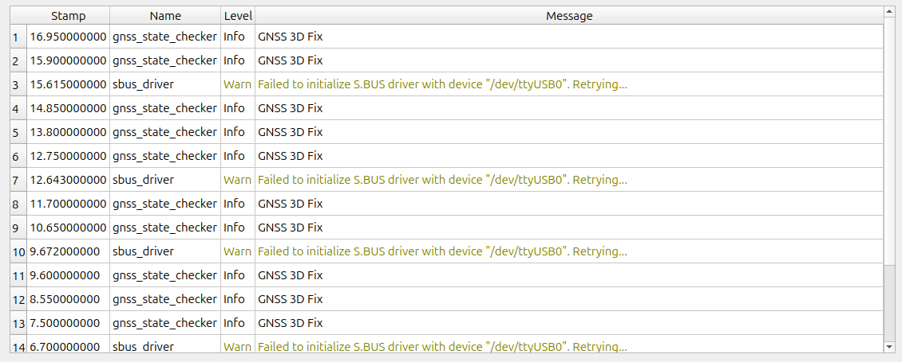

# User Code (C++)

This section assumes that you have a basic understanding of C++ and ROS 2.
To learn ROS 2, see
<a href=https://docs.ros.org/en/jazzy/Tutorials.html target="_blank">Tutorials | ROS 2 Documentation</a>
.

Among the ROS packages in a Tobas project created with Setup Assistant (e.g., tobas_f450.TBS),
the user C++ package (e.g., tobas_f450_user_cpp) is a C++ package that users can edit freely.
It contains the following five launch files.

- `common_(interface/realtime).launch.py`: Launched on both real hardware and in simulation.
- `real_(interface/realtime).launch.py`: Launched only on real hardware.
- `gazebo.launch.py`: Launched only in simulation.

`common` and `real` each contain two types of launch files: `interface` and `realtime`.
Nodes launched with the former can perform ROS communication across networks, whereas nodes launched with the latter cannot.
Therefore, for a node launched with `*_realtime.launch` to communicate across networks,
it must go through an interface node launched with `*_interface.launch`.
This design prevents the node discovery algorithm used by DDS, the ROS 2 backend, from adversely affecting real-time performance.

As an example, let's create a C++ node that checks the GNSS status and outputs a message every second when a 3D fix is available.
Edit `tobas_f450_user_cpp/nodes/user_node.cpp` as follows.

```cpp
#include <tobas_constants/ros_interface.hpp>
#include <tobas_node/node.hpp>

#include <tobas_msgs_adapter/gnss.hpp>

class UserNode : public tobas::BaseNode
{
  using self = UserNode;
  using super = tobas::BaseNode;

public:
  explicit UserNode(const rclcpp::NodeOptions& options = rclcpp::NodeOptions());

private:
  tobas::ros2::SubscriberPtr<tobas_msgs::Gnss> gnss_sub_;

  void gnssCb(const tobas_msgs::Gnss::ConstSharedPtr& gnss);
};

UserNode::UserNode(const rclcpp::NodeOptions& options)
  : super("gnss_state_checker", nodeOptions_Default(options))
{
  gnss_sub_ = createSubscriber<tobas_msgs::Gnss>(tobas::topic::kGnss, &self::gnssCb, this);
}

void UserNode::gnssCb(const tobas_msgs::Gnss::ConstSharedPtr& gnss)
{
  if (gnss->fix_type == tobas_msgs::msg::Gnss::FIX_3D) {
    TOBAS_INFO_THROTTLE(1., "GNSS 3D Fix");
  }
}

RCLCPP_COMPONENTS_REGISTER_NODE(UserNode)
```

Add the dependency packages used by this node to `tobas_f450_user_cpp/package.xml`.

```xml
<depend>tobas_constants</depend>
<depend>tobas_node</depend>
<depend>tobas_msgs_adapter</depend>
```

Add this node as a build target.
Add the dependency packages to `tobas_f450_user_cpp/CMakeLists.txt` and uncomment the build instructions.

```cmake
cmake_minimum_required(VERSION 3.25)
project(tobas_f450_user_cpp)

if(NOT CMAKE_BUILD_TYPE AND NOT CMAKE_CONFIGURATION_TYPES)
  set(CMAKE_BUILD_TYPE "Release" CACHE STRING "Build type (default Release)" FORCE)
endif()

set(CMAKE_CXX_STANDARD 23)
set(CMAKE_CXX_STANDARD_REQUIRED ON)
set(CMAKE_CXX_EXTENSIONS OFF)
set(CMAKE_CXX_FLAGS "${CMAKE_CXX_FLAGS} -Wall -Wextra -Wpedantic -Wshadow -Wswitch-enum -Werror")
set(CMAKE_POSITION_INDEPENDENT_CODE ON)

set(AMENT_DEPENDENCIES
  rclcpp
  rclcpp_components
  tobas_constants
  tobas_node
  tobas_msgs_adapter
)

find_package(ament_cmake REQUIRED)

foreach(dependency IN ITEMS ${AMENT_DEPENDENCIES})
  find_package(${dependency} REQUIRED)
endforeach()

include_directories(include)

add_library(${PROJECT_NAME} SHARED nodes/user_node.cpp)
ament_target_dependencies(${PROJECT_NAME} ${AMENT_DEPENDENCIES})
target_link_options(${PROJECT_NAME} PRIVATE -Wl,--no-undefined)
rclcpp_components_register_node(${PROJECT_NAME} PLUGIN "UserNode" EXECUTABLE user_node)

install(
  TARGETS ${PROJECT_NAME}
  EXPORT ${PROJECT_NAME}
  LIBRARY DESTINATION lib
  ARCHIVE DESTINATION lib
  RUNTIME DESTINATION bin
  INCLUDES
  DESTINATION include
)

install(DIRECTORY launch DESTINATION share/${PROJECT_NAME})

ament_package()
```

Configure this node to start automatically.
Although it could be launched as a regular ROS node, this time we will launch it as a component to eliminate copying in topic communication.

In Tobas, three component managers (`component_manager_x (x = 1, 2, 3)`) run on separate CPUs,
and topic communication between their components is also zero-copy.
Lower-numbered managers handle faster processes that are less tolerant of latency. Their general roles are as follows.

- `component_manager_1`: IMU filtering, state estimation, attitude/position control, etc. (400-800Hz)
- `component_manager_2`: Path planning, mission execution, etc. (30-100Hz)
- `component_manager_3`: Parameter server, logging, failsafe, etc. (1-10Hz)

Because the processing performed by this node is not time-critical, plug it into `component_manager_3`, which handles the slowest processes.
Uncomment the `add_action` section in `tobas_f450_user_cpp/launch/common_realtime.launch.py`.

```python
# Do not delete or rename this file because it is executed in tobas_f450_config/common_realtime.launch.py.

from launch import LaunchDescription
from launch_ros.actions import LoadComposableNodes
from launch_ros.descriptions import ComposableNode


def generate_launch_description():
    ld = LaunchDescription()

    # Please add the nodes that run both on real hardware and in simulation, with real-time requirements.

    ld.add_action(
        LoadComposableNodes(
            target_container=f"f450/component_manager_3",
            composable_node_descriptions=[
                ComposableNode(
                    package="tobas_f450_user_cpp",
                    plugin="UserNode",
                    extra_arguments=[{"use_intra_process_comms": True}],
                ),
            ],
        )
    )

    return ld
```

When you start the simulation from the GCS, a message appears in the `Control System` console.



For details about the API, see [ROS API](./ros_api.md).
