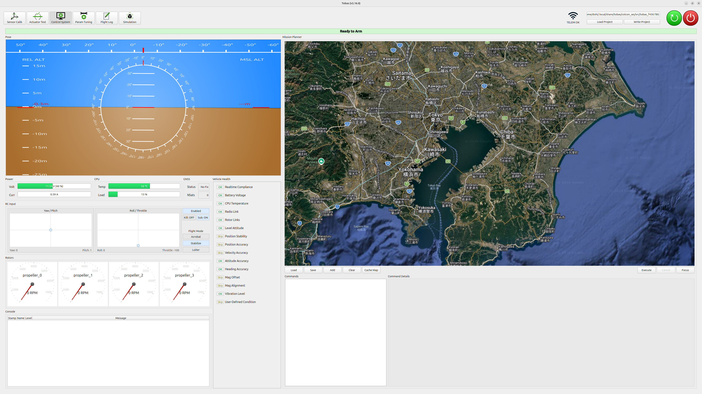
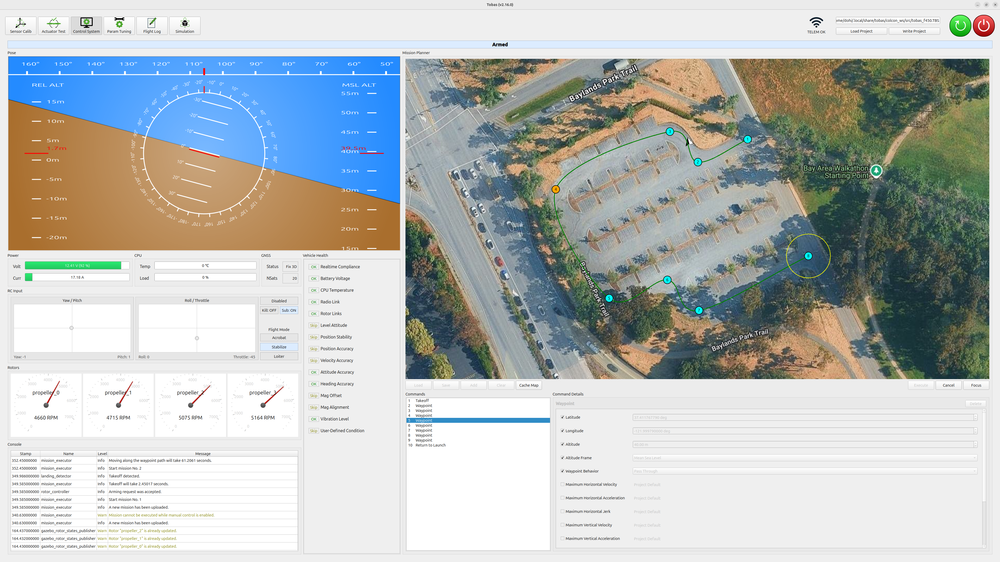
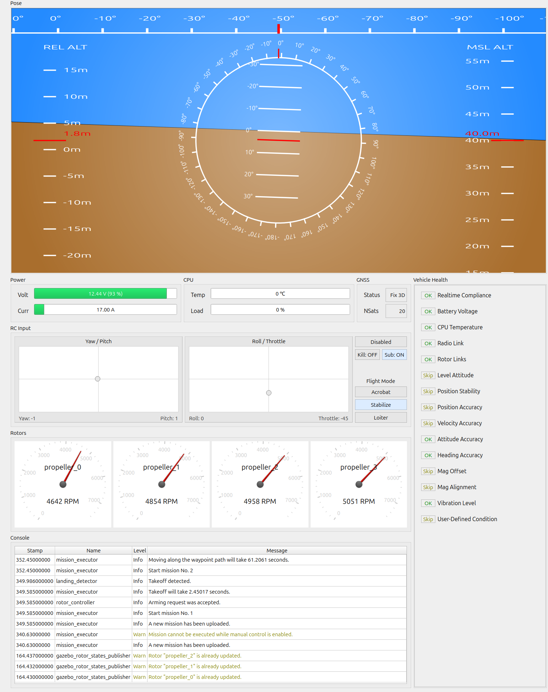
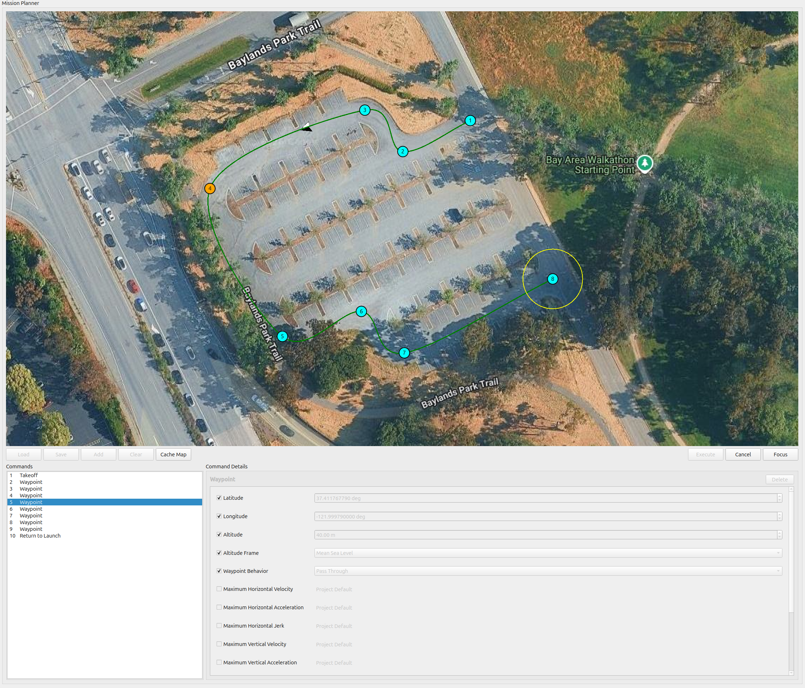
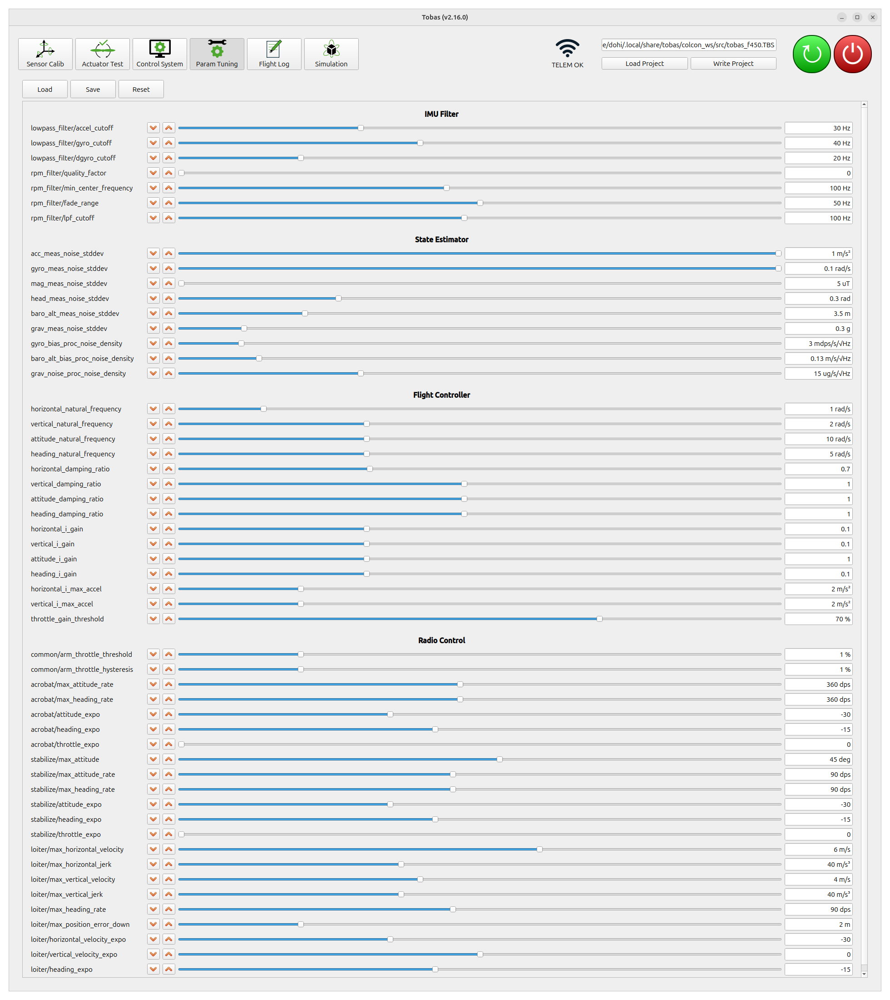
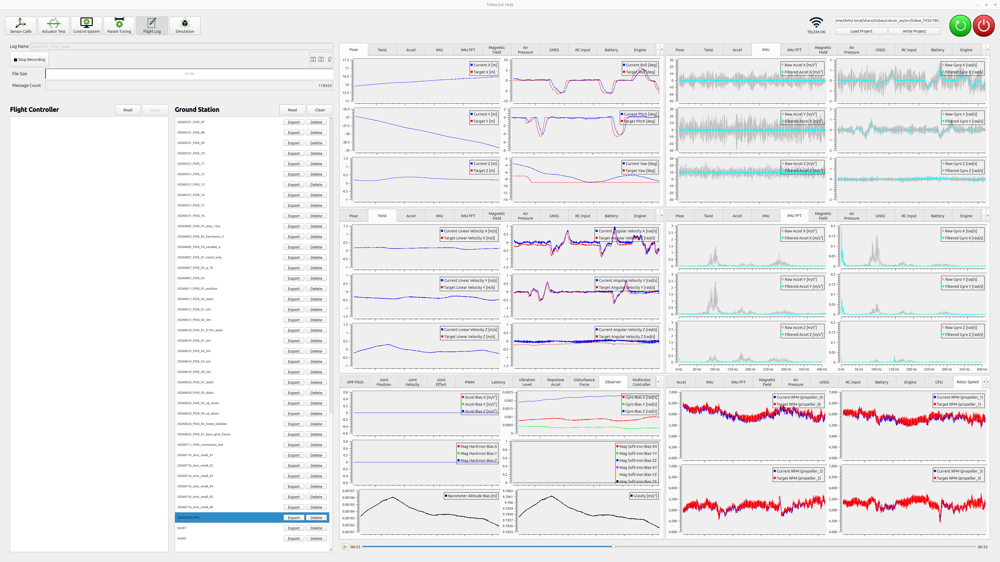

# Flight Test

## Startup and Shutdown Procedures

---

### Startup Procedure

1. Connect the battery to the drone.
1. Connect the PC to the same network as the FC.
1. Launch Tobas GCS.
1. Click `Load Project` and load `tobas_f450.TBS`.
1. Click `Control System` in the toolbar to open it.
1. Pass the pre-arm safety checks and confirm that `Ready to Arm` is lit green.
1. Turn on the RC transmitter, turn on the `Enable` switch, and turn off the `Kill` switch.
1. Select the flight mode using the switch on the RC transmitter. `Stabilize` (attitude control mode) is the safest mode to start with.
1. To arm the drone, hold the throttle stick down and the yaw stick to the right for one second.
1. Once armed, return the yaw stick to the center and gradually raise the throttle stick.

<iframe width="560" height="315" src="https://www.youtube.com/embed/sHoA8yKJPs4?si=CCOEPsu6z9hd7zOb" title="YouTube video player" frameborder="0" allow="accelerometer; autoplay; clipboard-write; encrypted-media; gyroscope; picture-in-picture; web-share" referrerpolicy="strict-origin-when-cross-origin" allowfullscreen></iframe>
 

<!-- prettier-ignore-start -->
!!! note
    In environments where GNSS is unavailable, such as indoors, the position and velocity checks cannot pass.
    These checks must be disabled from the Fail-Safe tab in Setup Assistant.
<!-- prettier-ignore-end -->

### Shutdown Procedure

1. To disarm the drone, hold the throttle stick down and the yaw stick to the left for one second.
   Alternatively, turn on the `Kill` switch to disarm it immediately.
1. Click the GCS power button (red) to shut down the FC.
1. Exercise extreme caution and disconnect power from the FC and ESC.

The following sections describe the ground station's features.

## Control System

---

`Control System` is a tool for monitoring the drone's status and planning missions.

### Status Monitoring

The left side of the screen displays the following status information:

- Attitude: roll, pitch, yaw
- Battery status: voltage, current
- CPU status: temperature, load
- GNSS status: status, number of satellites
- RC input: sticks, kill switch, flight mode, other switches
- Motor status: speed, communication status
- Status: Pre-Arm Check, Post-Arm Check, and others
- Messages from each node

### Mission Planning

The right side of the screen provides mission planning features for creating and executing flight missions.

1. Click `Add` to add a command.
   The figure below shows a mission consisting of `Takeoff`, nine `Waypoint` commands, `Return to Home`, and finally `Land`.
1. Set the parameters for each command in the dialog at the bottom right of the screen.
   Waypoint coordinates can also be adjusted by dragging and dropping their icons on the map.
1. Click the `Execute` button to execute the mission.

<!-- prettier-ignore-start -->
!!! note
    If the `Enable` switch on the RC transmitter is on, commands from the transmitter take priority. Always turn it off before executing a mission.
<!-- prettier-ignore-end -->

## Param Tuning

---

`Param Tuning` is a tool for tuning flight parameters online.

### Procedure

1. Click `Load` to load the current parameters from the FC.
1. Adjust the parameters online using the increment/decrement buttons or sliders.
1. Click `Save` to save the current parameters to the project folder on the local PC.
1. After the flight, click `Write` to flash the saved parameters to the FC.

### Main Parameters

#### attitude_natural_frequency

This parameter controls the responsiveness of attitude control.
A higher value provides a faster response to the target attitude, but an excessively high value makes attitude control unstable.
Gradually increase the value while ensuring that no oscillation occurs.
For this aircraft, the value could be increased to 25 rad/s.

#### heading_natural_frequency

This parameter controls the responsiveness of heading control.
A higher value provides a faster response to the target heading, but an excessively high value makes heading control unstable.
Gradually increase the value while ensuring that no oscillation occurs.
The default value was used in this case.

#### horizontal_natural_frequency

This parameter controls the responsiveness of horizontal position control.
A higher value provides a faster response to the target position, but an excessively high value makes position control unstable.
Gradually increase the value while ensuring that no oscillation occurs.
The default value was used in this case.

#### vertical_natural_frequency

This parameter controls the responsiveness of vertical position control.
A higher value provides a faster response to the target altitude, but an excessively high value makes altitude control unstable.
Gradually increase the value while ensuring that no oscillation occurs.
The default value was used in this case.

#### lowpass_filter/gyro_cutoff

This is the cutoff frequency of the gyroscope's low-pass filter.
A lower value suppresses more gyroscope noise, but an excessively low value introduces signal delay that can make angular velocity control unstable.
Check the flight log (described below), and
if **the target motor speed oscillates with an amplitude of 10% or more of the hovering speed**, consider the filtered angular velocity oscillation excessive and reduce the value.
The default value was used in this case.

<!-- prettier-ignore-start -->
!!! tip
    Some FMUs support an [RPM filter](../additional_information/rpm_filter.md) that efficiently attenuates propeller vibration.
    It can be configured here in the same way as the parameters above.
    We recommend enabling this powerful feature.
<!-- prettier-ignore-end -->

## Flight Log

---

`Flight Log` is a tool for recording and replaying the drone's status during flight.

### Recording a Flight Log

1. Enter a log name (e.g., 20260101_f450_hover) in `Log Name`.
1. Click the `Start Recording` button to start recording the log.
1. Click the `Stop Recording` button to stop recording.

### Viewing a Flight Log

1. Click the `Read` buttons on the FC and PC sides to display the lists of logs stored on each.
1. Click the `Download` button to the right of a log name in the FC-side list to download the corresponding log to the PC.
1. Click a log name in the PC-side list to plot the stored data on the right.
1. Use the play/stop buttons and slider at the bottom right to control the displayed time in the log.
