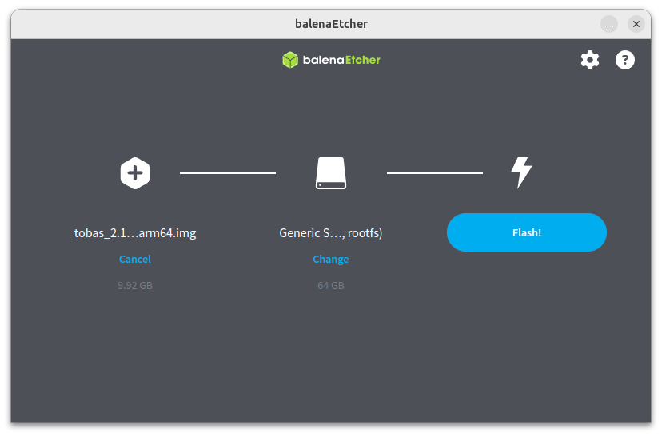

# Installation

## Installing Tobas on a PC

---

### Installing ROS 2 Jazzy

Follow the <a href=https://docs.ros.org/en/jazzy/Installation/Ubuntu-Install-Debs.html target="_blank">official ROS 2 Jazzy instructions</a>
to install ROS 2 from deb packages.
This documentation uses `ros-jazzy-desktop`.

### Installing Tobas

Install Tobas from the ROS 2 apt repository.

```bash
$ sudo apt update
$ sudo apt install ros-jazzy-tobas
```

In each terminal where you use Tobas, source the ROS 2 Jazzy environment.

```bash
$ source /opt/ros/jazzy/setup.bash
```

## Flashing the Flight Controller Image

---

### Requirements

- <a href=https://www.raspberrypi.com/products/raspberry-pi-5/ target="_blank">Raspberry Pi 5 (2 GB or more)</a>
- Tobas HAT <!-- TODO: URL -->
- A microSD card with at least 16 GB of storage (e.g., <a href=https://www.sandisk.com/products/memory-cards/microsd-cards/sandisk-extreme-uhs-i-microsd target="_blank">SanDisk Extreme microSDXC™ UHS-I CARD - 32GB</a>)
- An SD card reader (e.g., <a href=https://www.sandisk.com/products/accessories/memory-card-readers/sandisk-quickflow-microsd-memory-card-reader-usb-c target="_blank">SANDISK QuickFlow microSD Card Reader with USB-C</a>)

### Procedure

Download <a href=https://drive.google.com/file/d/1B80llkgNSvuoI6HSFZNbjZA3OYDf1oZ2/view target="_blank">tobas_2.16.0_arm64.img.gz</a>.

Install a suitable image flashing tool. For example, you can use one of the following:

- <a href=https://etcher.balena.io/ target="_blank">balenaEtcher</a>
- <a href=https://www.raspberrypi.com/software/ target="_blank">Raspberry Pi Imager</a>

Connect the SD card to the PC using the card reader.

Launch the image flashing tool, select the downloaded image and the target SD card, and start flashing.
The following screenshot shows balenaEtcher.



Once flashing completes successfully, remove the SD card from the PC.

## Next Steps

---

The installation is now complete.
We recommend restarting the PC before proceeding to apply the changes made during installation.
Next, use Tobas Bootmedia Config to perform the initial pre-boot configuration.
