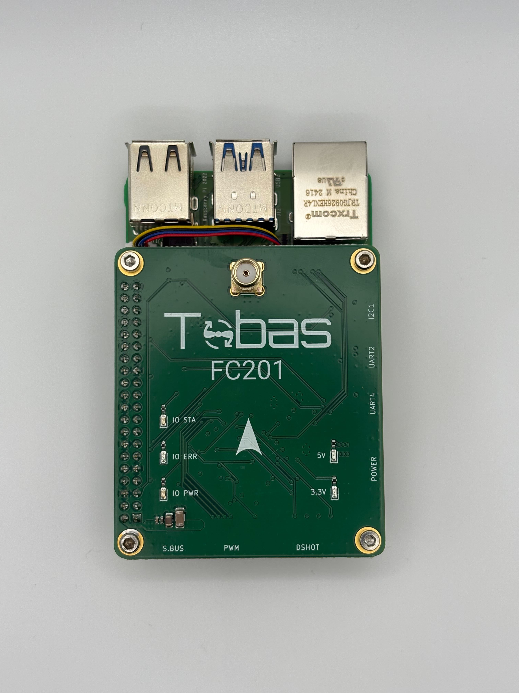
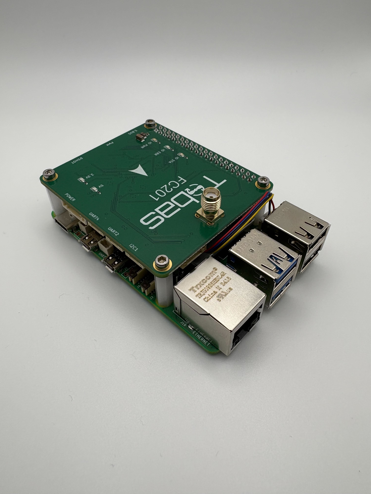

# Tobas User Guide

Tobas is a flight controller for drones and robotic aircraft, built on model-based design and Linux.
Unlike conventional flight controllers, it designs the control system with detailed consideration of each aircraft's structure,
enabling even aircraft that are difficult for conventional flight controllers to fly with high precision.

## Features

---

- Defines the aircraft structure in a proprietary format and accurately reflects it in the controller
- Improves responsiveness and tracking accuracy through motor speed control
- Compensates for gravity and reaction forces caused by changes in movable joint angles
- Compensates for disturbances such as gusts and ground effect
- Allows aircraft configurations and control parameters to be set through a GUI
- Supports ROS 2 and provides the same interface for simulation and real hardware

## What Tobas Can Do

---

### Improved Control Performance

Tobas accurately uses the physical characteristics of the user's aircraft for control,
providing better control performance than conventional flight controllers.
For example, it considers the following information:

- Dynamic parameters of each rigid-body link: mass, center of mass, and inertia tensor
- Battery specifications: cell count, discharge capacity, and discharge rate
- Motor specifications: KV rating, internal resistance, and pole count
- Propeller specifications: diameter, pitch, thrust constant, and reaction torque constant

### Greater Aircraft Design Freedom

In Tobas, the aircraft structure is defined using [UADF (Universal Aircraft Description Format)](./additional_information/what_is_uadf.md),
enabling a wide range of aircraft that are difficult to fly with conventional flight controllers.
For example, Tobas supports unconventional aircraft such as:

- Aircraft with a center of mass significantly offset from the center due to the payload
- Aircraft with asymmetric propeller placement to ensure a clear camera field of view
- Aircraft equipped with a robotic arm
- Aircraft equipped with tilt rotors

### Reduced Gain-Tuning Effort

Accurate aircraft modeling allows the translational and rotational dynamics to be extracted in an aircraft-independent form and analyzed in advance.
Tobas therefore comes with stable default gains, allowing users to fly their aircraft without gain tuning in most cases.
If necessary, all parameters can also be adjusted online during flight.

### Realistic Simulation

By considering the aircraft's mass properties and the aerodynamic characteristics of its propulsion system, Tobas enables realistic physics simulation.
This can significantly reduce the cost of real-world testing.

The following factors, which can have a major impact on flight, can be simulated easily:

- Wind (steady wind, turbulence, and gusts)
- Battery voltage drop
- ESC maximum current
- Sensor latency and noise
- Suspended payloads

## Flight Management Unit (FMU)

### Tobas FC201

#### Sensors & Processors

- 6-axis IMU: <a href=https://www.st.com/ja/mems-and-sensors/ism330dlc.html target="_blank">ISM330DLC | STMicroelectronics</a>
- Magnetometer: <a href=https://www.st.com/ja/mems-and-sensors/iis2mdc.html target="_blank">IIS2MDC | STMicroelectronics</a>
- Barometer: <a href=https://www.st.com/ja/mems-and-sensors/ilps22qs.html target="_blank">ILPS22QS | STMicroelectronics</a>
- GNSS Receiver: <a href=https://www.u-blox.com/en/product/zed-f9p-module target="_blank">ZED-F9P | u-blox</a>
- Voltage/Current Sensor: <a href=https://www.ti.com/product/ja-jp/INA228 target="_blank">INA228 | Texas Instruments</a>
- Main Computer: <a href=https://www.raspberrypi.com/products/raspberry-pi-5 target="_blank">Raspberry Pi 5</a>
- I/O Controller: <a href=https://www.st.com/ja/microcontrollers-microprocessors/stm32h7a3-7b3.html target="_blank">STM32H7A3 | STMicroelectronics</a>

#### Interface

- GNSS Antenna: SMA
- Power Module: Molex 2.0mm 6pin
- UART, I2C Interface: JST-GH 4pin

## Examples

---

### Quadcopter

A typical quadcopter.
It uses a DJI F450 frame kit.

<iframe width="560" height="315" src="https://www.youtube.com/embed/sHoA8yKJPs4?si=CCOEPsu6z9hd7zOb" title="YouTube video player" frameborder="0" allow="accelerometer; autoplay; clipboard-write; encrypted-media; gyroscope; picture-in-picture; web-share" referrerpolicy="strict-origin-when-cross-origin" allowfullscreen></iframe>
 

### Hexacopter with a Non-Planar Rotor Layout

A hexacopter with all propellers tilted 30 degrees from the horizontal plane.
While multicopters with a planar rotor layout must change their attitude to change position,
multicopters with a non-planar rotor layout can control position and attitude independently.
This allows them to translate while remaining level or change attitude while hovering.
They can also generate thrust directly in the horizontal direction, providing high positioning accuracy and excellent wind resistance.

<iframe width="560" height="315" src="https://www.youtube.com/embed/1RIXLGmx1RA?si=ADkOlZsAMb1tHyNr" title="YouTube video player" frameborder="0" allow="accelerometer; autoplay; clipboard-write; encrypted-media; gyroscope; picture-in-picture; web-share" allowfullscreen></iframe>
 

### Active-Tilt Hexacopter

A hexacopter whose arms can each rotate 120 degrees in either direction.
Its key feature is the ability to make large attitude changes while hovering.
Because attached inspection equipment can be held at any orientation, potential applications include nondestructive inspection of inclined walls.

<iframe width="560" height="315" src="https://www.youtube.com/embed/UYwoFjf6ubc?si=RsDKgr98DVvdhaWB" title="YouTube video player" frameborder="0" allow="accelerometer; autoplay; clipboard-write; encrypted-media; gyroscope; picture-in-picture; web-share" referrerpolicy="strict-origin-when-cross-origin" allowfullscreen></iframe>
 

### Robotic Arm Drone

An aircraft based on a tilt hexacopter and equipped with a 4-axis robotic arm.
By dynamically compensating for reaction forces and changes in the center of mass caused by the arm,
the aircraft can keep its position and attitude within a limited range even when the arm moves vigorously.

<iframe width="560" height="315" src="https://www.youtube.com/embed/3peWIltNV3o?si=OLdfuQGEHEI1L_N-" title="YouTube video player" frameborder="0" allow="accelerometer; autoplay; clipboard-write; encrypted-media; gyroscope; picture-in-picture; web-share" referrerpolicy="strict-origin-when-cross-origin" allowfullscreen></iframe>

## System Requirements

---

### PC <!-- cf. https://www.solidworks.com/ja/support/system-requirements -->

The following requirements must be met.

| Requirement        | Required                       | Recommended        | Notes                           |
| :----------------- | :----------------------------- | ------------------ | ------------------------------- |
| OS                 | Ubuntu 24.04 LTS (ROS 2 Jazzy) |                    | Native installation recommended |
| RAM                | 8GB                            | 16GB               |                                 |
| CPU                | AMD64 (x86-64)                 |                    |                                 |
| GPU                |                                | NVIDIA GeForce RTX |                                 |
| Display Resolution | 2K/FHD                         | 4K/UHD             |                                 |

 

### ESC

The ESC must support the Bidirectional DShot protocol.
For example, the following firmware supports it:

- <a href=https://github.com/bitdump/BLHeli/tree/master/BLHeli_32%20ARM target="_blank">BLHeli_32</a> (support ended in June 2024)
- <a href=https://github.com/AlkaMotors/AM32-MultiRotor-ESC-firmware target="_blank">AM32</a>
- <a href=https://github.com/bird-sanctuary/bluejay target="_blank">bluejay</a>

### GNSS Antenna

The antenna must support the frequency bands and connector of the GNSS receiver installed in the FMU.

### RC Receiver

The receiver must support S.BUS with at least 8 channels.
