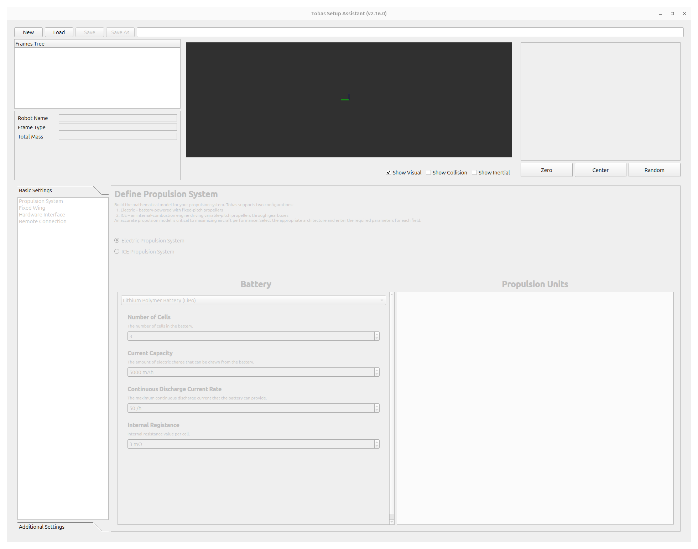
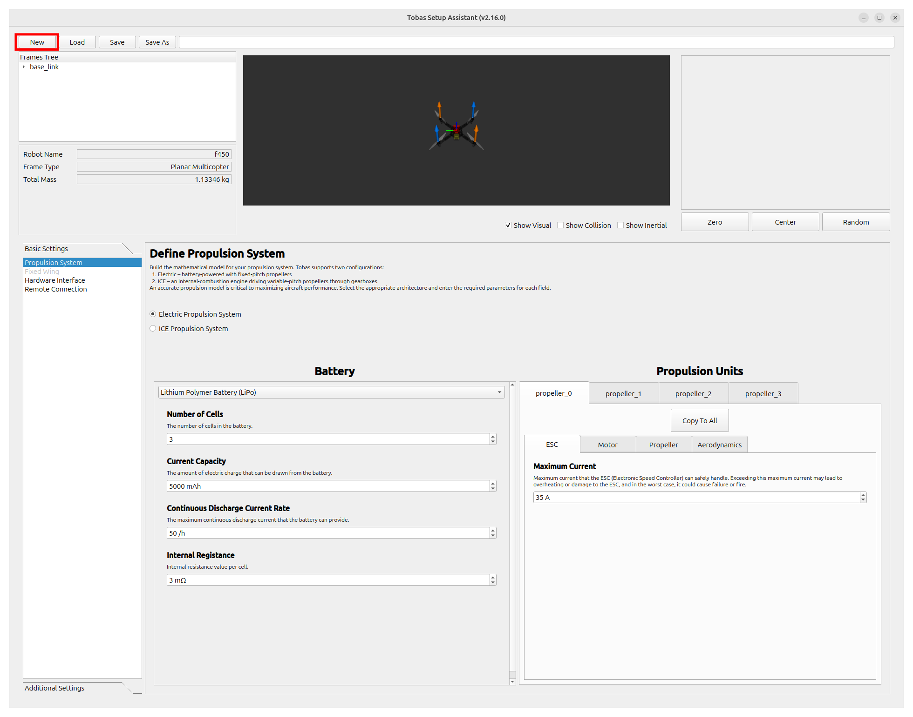
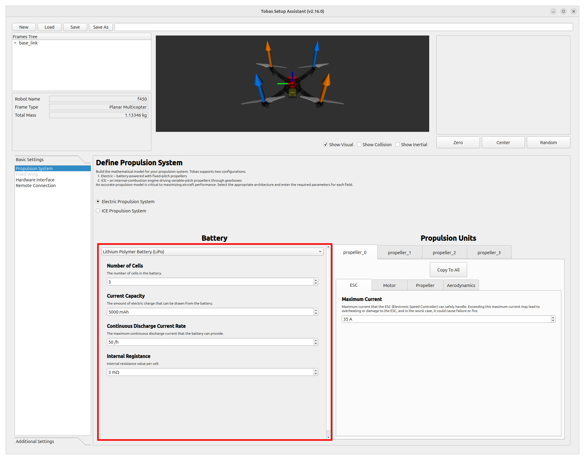
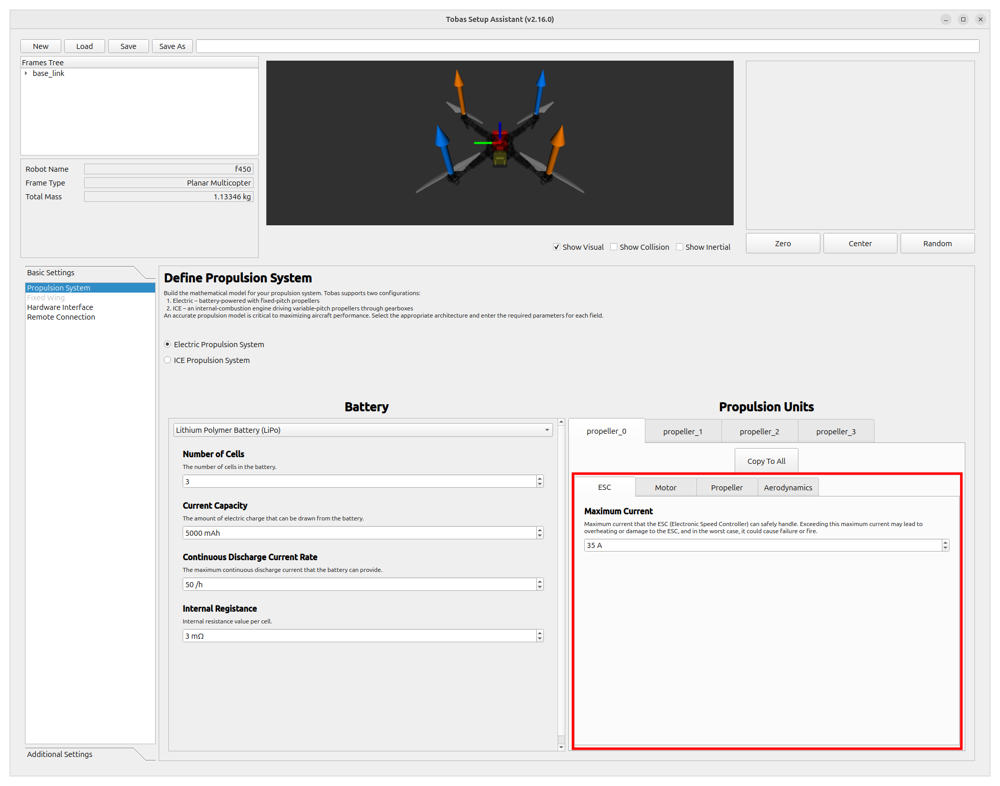
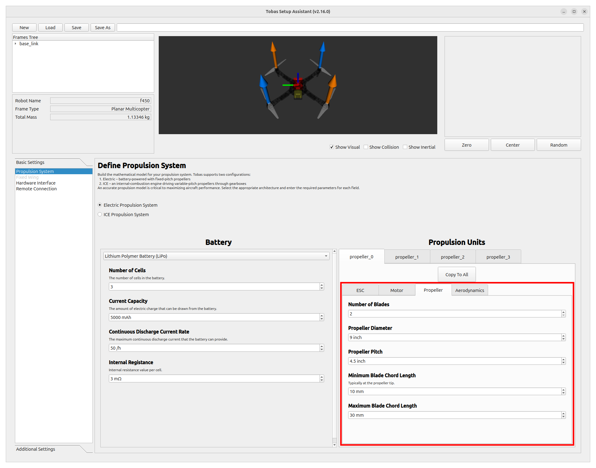
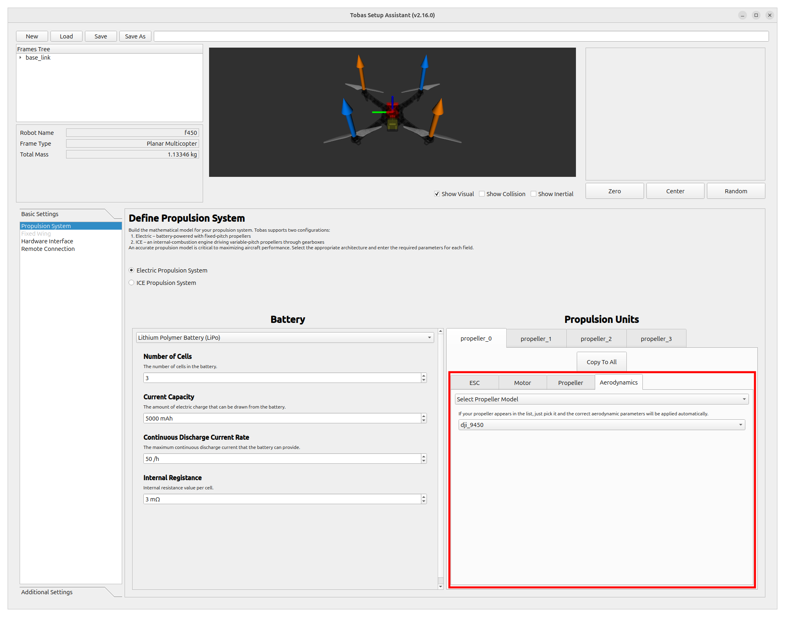
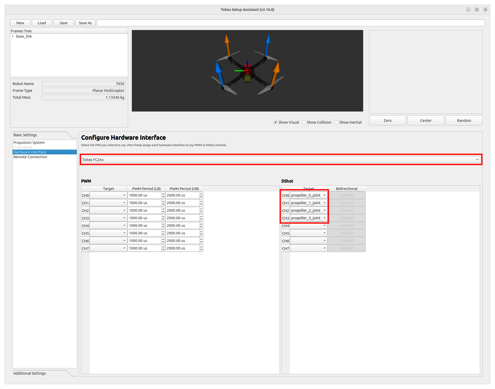
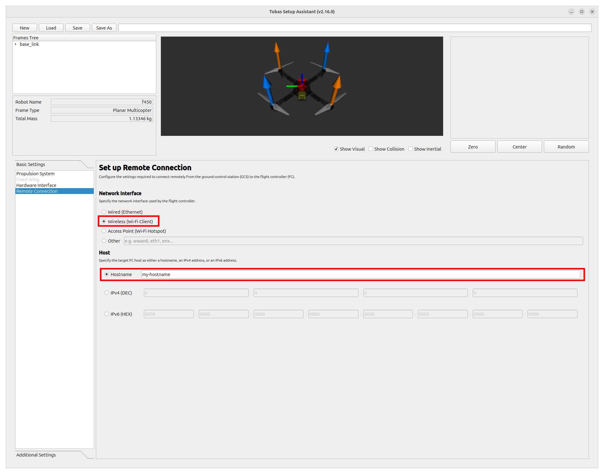
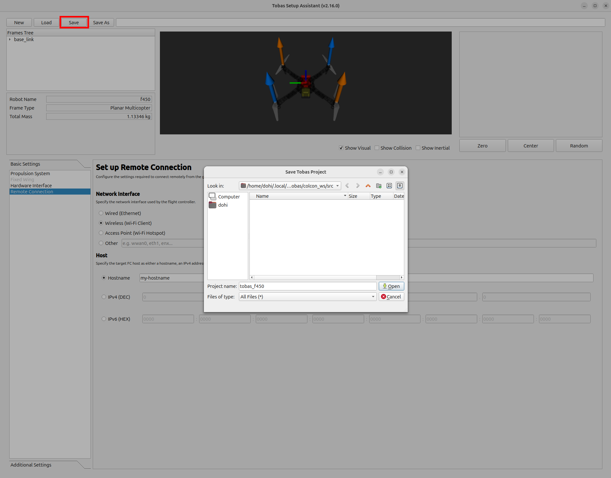

# 機体構成の設定

<!-- ゲームの広告と同じで，全てを理解することよりもとりあえず何も考えずに簡単に動かせることが大事． -->
<!-- 後々必要になる面倒な作業は隠して面白いところを見せる． -->

Tobas Setup Assistant を用いて機体構成に関する設定を行います．
Tobas Setup Assistant は，Tobas を用いてドローンを飛ばすのに必要なプロジェクトフォルダを作成するための GUI です．
プロジェクトフォルダには，機体の質量特性，プロペラの空気特性，モータの電気特性といった，ドローンを飛ばすのに必要な全ての情報が含まれます．
Tobas Setup Assistant を使用するためには，ユーザの機体を表現した Universal Aircraft Description Format (UADF) ファイルが必要です．
UADF の詳細については[What is UADF](../additional_information/what_is_uadf.md)をご参照ください．

## 準備

---

このチュートリアルでは，典型的なクアッドコプターである DJI F450 を使用します．
構成部品は以下のとおりです：

- フライトコントローラ: <a href=https://tobas.jp/product target="_blank">Tobas FC201</a>
- Power Module: <a href=https://holybro.com/products/pm02d-power-module target="_blank">Holybro PM02D</a>
- フレーム: <a href=https://www.hawks-work.com/products/f450-drone-frame-450mm-wheelbase-quadcopter-frame-kit-with-landing-skid-gear target="_blank">DJI F450 Frame</a>
- モータ: <a href=https://www.hawks-work.com/products/a2212-brushless-motor-920kv-for-multirotor-drone-and-others target="_blank">A2212 920KV</a> (CW x 2, CCW x 2)
- プロペラ: <a href=https://www.hawks-work.com/products/9450-propellers-self-tightening-cw-ccw-propeller-for-multirotor-f450 target="_blank">DJI 9450</a> (CW x 2, CCW x 2)
- ESC: <a href="https://www.fly-color.net/index.php?c=category&id=234" target="_blank">Flycolor Raptor5 35A</a> x 4
- バッテリー: <a href=https://hrb-power.com/products/11-1v-5000mah-6000mah-50c-trx target="_blank">HRB 3S 5000mAh 50C</a>
- GNSS アンテナ: <a href=https://www.topgnss.store/en-jp/products/top901-gnss-l1-l2-l5-unmanned-vehicle-high-precision-drone-measurement-full-frequency-rtk-antenna-new-small-high-gain-helical target="_blank">TOPGNSS TOP901</a>
- RC 受信機: <a href=https://www.rc.futaba.co.jp/products/detail/I00000021 target="_blank">Futaba R2000SBM</a>

機体の UADF を作る必要がありますが，今回は既に用意してあるものを使用します．

## 起動

---

ターミナルで以下を実行し，Tobas Setup Assistant を起動します．

```bash
$ ros2 launch tobas_setup_assistant setup_assistant.launch.py
```



## UADF の読み込み

---

`New`をクリックし，ファイルダイアログで`/opt/ros/jazzy/share/tobas_description/urdf/f450.uadf`を選択して`Open`をクリックします．
すると，モデルビューに機体が表示され，各設定ページが有効になります．



## Propulsion System

---

推進系の設定を行います．
今回は電動機のため`Electric Propulsion System`にチェックを入れたままにします．

### Battery

バッテリーの設定を行います．
バッテリーの仕様を確認し，各項目に適切な値を入力してください．



### Propulsion Units

各推進ユニットの設定を行います．

まず`propeller_0`リンクの設定を行います．
各部品の仕様を確認し，`ESC`，`Motor`，`Propeller`の各項目に適切な値を入力してください．

<!-- prettier-ignore-start -->
!!! tip
    機体上のプロペラと表示されているリンク名との対応関係がわからない場合は，
    画面左上の`Frame Tree`からリンク名をクリックすることでモデルビューにハイライトされます．
<!-- prettier-ignore-end -->






`Aerodynamics`ではプロペラの空力特性の設定を行います．
複数の設定方法から選ぶことができますが，今回使用するプロペラである DJI 9450 は予めモデルが用意されているので，それを使います．
最初の選択リストから`Select Propeller Model`を選択し，その下の選択リストで`dji_9450`を選択してください．



この機体の 4 つの推進ユニットは全て同一なため，`Copy To All`をクリックし，`propeller_0`の設定を他の 3 つにコピーします．
`propeller_0`の設定が他のタブにも反映されていることを確認してください．

## Hardware Interface

---

ハードウェアの接続に関する設定を行います．
`Tobas FC2xx`が選択されていることを確認し，
4 つの推進ユニットそれぞれについて，適切に DShot チャンネルを設定してください．



<!-- prettier-ignore-start -->
!!! note
    ここでインターフェースを指定しない場合，例えば CAN-ESC を使う場合などは，
    そのままではハードウェアは駆動されないため，
    ハードウェアと Tobas ソフトウェアを繋ぐ ROS ノードを自作する必要があります．
<!-- prettier-ignore-end -->

## Remote Connection

---

地上局から FC に遠隔で接続するための設定を行います．

### Network Interface

FC が外部と通信する際に使用するネットワークインターフェースを指定します．
今回は FC と GCS の通信にポケット Wi-Fi を使うため，`Wireless`を選択します．
有線 LAN を使用する場合は`Wired`，
外部の通信モジュールを使わずラズパイ内蔵のアクセスポイントを使用する場合は`Access Point`を選択してください．
これら以外の構成の場合，例えば VPN のインターフェース`tun0`を使う場合などは，`Other`を選択し直接インターフェース名を指定してください．

### Host

GCS が LAN 内で FC を識別するためのアドレスの設定を行います．
FC の IP を固定していればそれを直接使用することもできますが，今回は手軽なホスト名を使用することにします．
`Hostname`を選択し，[Boot Device Configuration](./bootmedia_config.md)で設定した FC のホスト名を入力してください．



## プロジェクトの保存

`Save`をクリックし，ファイルダイアログで`~/.local/share/tobas/colcon_ws/src/`以下に`tobas_f450.TBS`として保存します．



## 次の手順へ

---

これで作業は完了です．
Setup Assistant を閉じてください．
次は，実機を作成してハードウェアのセットアップを行います．
