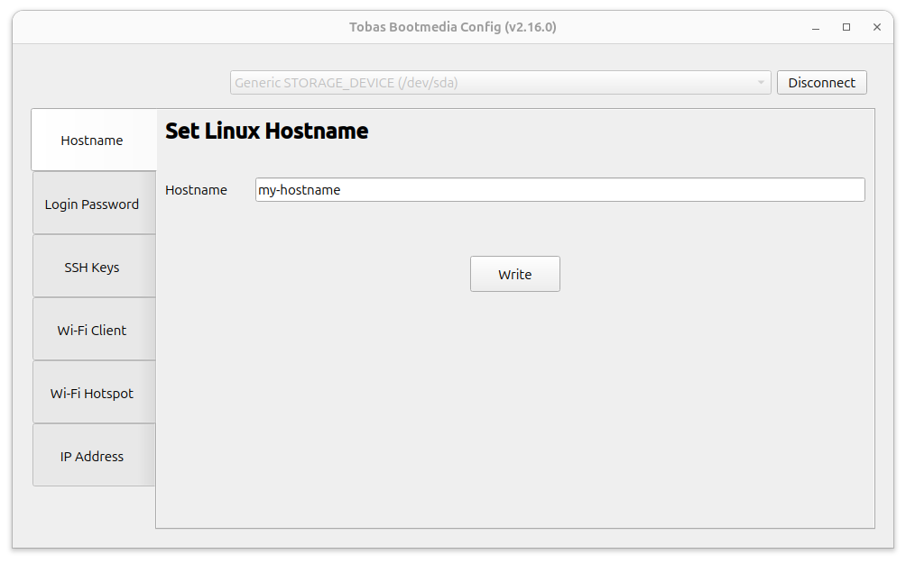
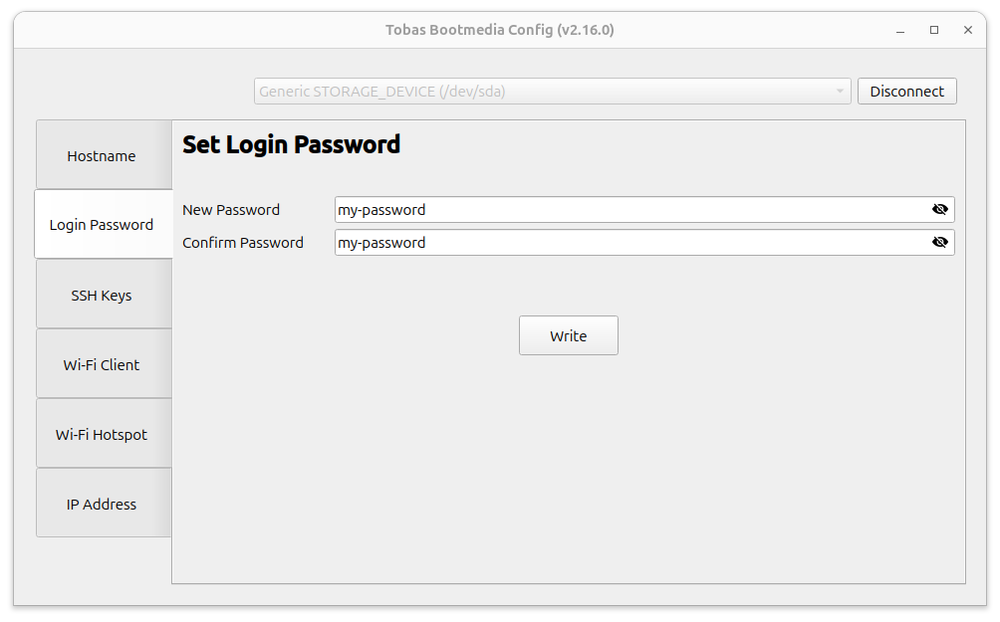
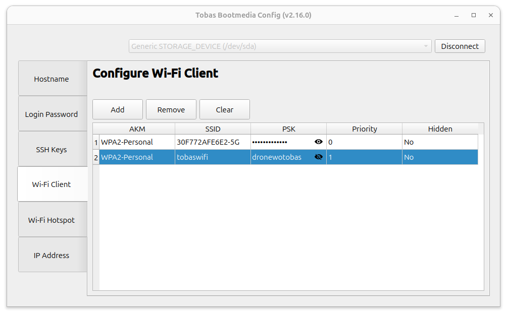
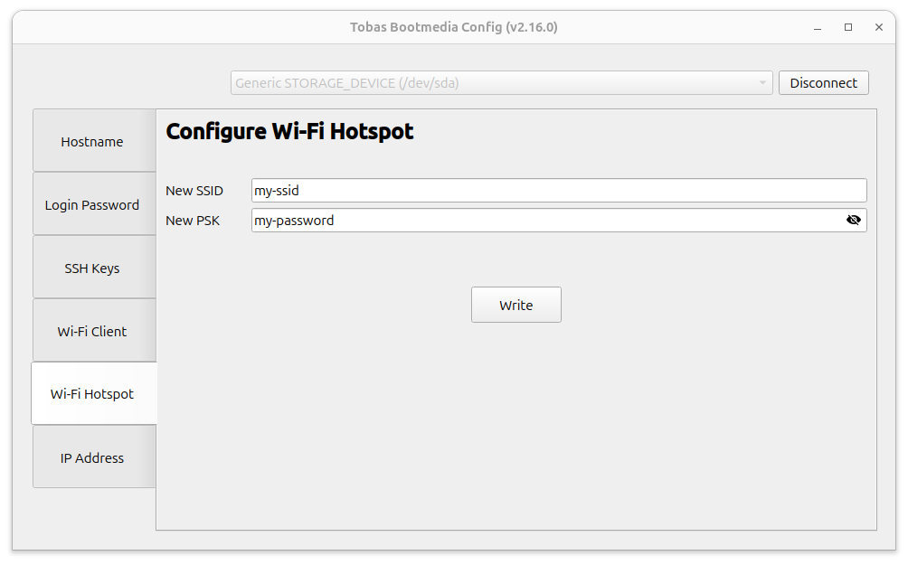

# ブートデバイスの設定

まずは，ブートデバイスを直接編集して通信関連の初期設定を行います．
Tobas のイメージが書き込まれたマイクロ SD カードを用意してください．

## 準備

---

### 設定用 GUI の起動

ターミナルで以下を実行し，Tobas Bootmedia Config を起動してください．
ここでは外部ボリュームを扱うためにルート権限が必要です．

```bash
$ sudo bash -c 'source /opt/ros/jazzy/setup.bash && ros2 run tobas_bootmedia_config TobasBootmediaConfig'
```


### ブートデバイスに接続

適当な USB カードリーダを介して，SD カードを PC に挿入してください．
Tobas イメージが正しく書き込まれていれば，GUI 上部の選択リストで SD カードが選択できるようになります．

正しい SD カードが選択されていることを確認し，`Connect`をクリックしてください．
すると，SD カードが PC にマウントされ，現在の設定が読み込まれます．


## 各種設定

---

### Hostname

Linux のホスト名を編集します．

Tobas では，デフォルトだとネットワーク上の端末を識別するためにホスト名が使用されるため，
想定されるサブネット内のホスト名がユニークである必要があります．
固定 IP での識別も可能ですが，複数機を同時に使用する場合は念の為ホスト名が被らないようにしておくことを勧めます．

ホスト名を編集し，`Write`をクリックすると新しいホスト名が SD カードに書き込まれます．



### Login Password

ログインパスワードを編集します．

デフォルトの`tobas`のままでも動作上は問題ありませんが，
セキュリティの観点から変更することが推奨されています．

`New Password`にログインパスワードを入力し，確認のため`Confirm Password`の欄にも同じものを入力してください．
両者が一致し，かつ有効なパスワードであれば`Write`ボタンが有効になります．
`Write`をクリックすると，入力したパスワードが SD カードに書き込まれます．



### SSH Keys

SSH 鍵認証の設定を行います．

Tobas では地上局からフライトコントローラ (FC) を操作するのに一部 SSH 鍵認証を用いているため，
地上局として使用する PC の公開鍵を FC に登録しておく必要があります．

まず SSH 鍵を作成します．
ターミナルで以下を実行して，`Passwords and Keys`を起動します．

```bash
$ seahorse
```

左上の`+`ボタンから`Secure Shell key`を選択します．
出てきたダイアログで`Description`に適当な識別子（`<ユーザ名>@<ホスト名>` など）を入力し，`Generate`をクリックします．
出てきたダイアログで`OK`をクリックすると SSH の公開鍵と秘密鍵が生成されます．パスワードは空欄のままで大丈夫です．
その後`OpenSSH keys`をクリックすると作成された鍵が表示されていることが確認できます．
鍵をダブルクリックし，出てきたダイアログで`Public key`をメモしたら`Passwords and Keys`を閉じてください．


`Tobas Bootmedia Config`に戻って`Add`をクリックし，出現するダイアログに先程メモした公開鍵をコピー＆ペーストしてください．
`OK`をクリックすると，公開鍵がリストに追加されると同時に SD カードにも書き込まれます．


### Wi-Fi Client

FC を Wi-Fi クライアントとして運用するための設定を行います．

Tobas は遠隔通信に ROS 2 (DDS) を用いており，
FC と地上局などの通信すべき端末は全て同じサブネットに属する必要があります．
イーサネットのみ使用する場合や，FC をアクセスポイントとして運用する場合は，この項目はスキップして構いません．

`Add`をクリックし，出現するダイアログに接続したいアクセスポイントの SSID と PSK を入力してください．
`Priority`は接続の優先度であり，複数のネットワークが利用可能な場合にはこの値が大きいほど優先されます．
`OK`をクリックすると，アクセスポイントがテーブルに追加されると同時に SD カードにも書き込まれます．



### Wi-Fi Hotspot

FC を Wi-Fi アクセスポイントとして運用するための設定を行います．

前述の通り，FC と地上局の通信のためには両者が同じサブネットに属する必要がありますが，
FC 自体をアクセスポイントにしておくと，屋外での試験飛行などの際に外部のルータを用意する必要がなくて便利です．
FC を Wi-Fi クライアントとしてのみ運用する場合は，この項目はスキップして構いません．

`New SSID`と`New PSK`にそれぞれ任意の SSID と PSK を入力してください．
両者とも有効であれば`Write`ボタンが有効になります．
`Write`をクリックすると，入力した SSID と PSK が SD カードに書き込まれます．



## 終了

---

ここまでの設定が完了したら，`Disconnect`をクリックしてください．
ブートデバイスがアンマウントされ，取り外し可能な状態になります．
GUI を閉じ，SD カードを PC から取り外してください．


## 次の手順へ

---

これで作業は完了です．
次は Tobas Setup Assistant を用いて最初のプロジェクトを作成します．
