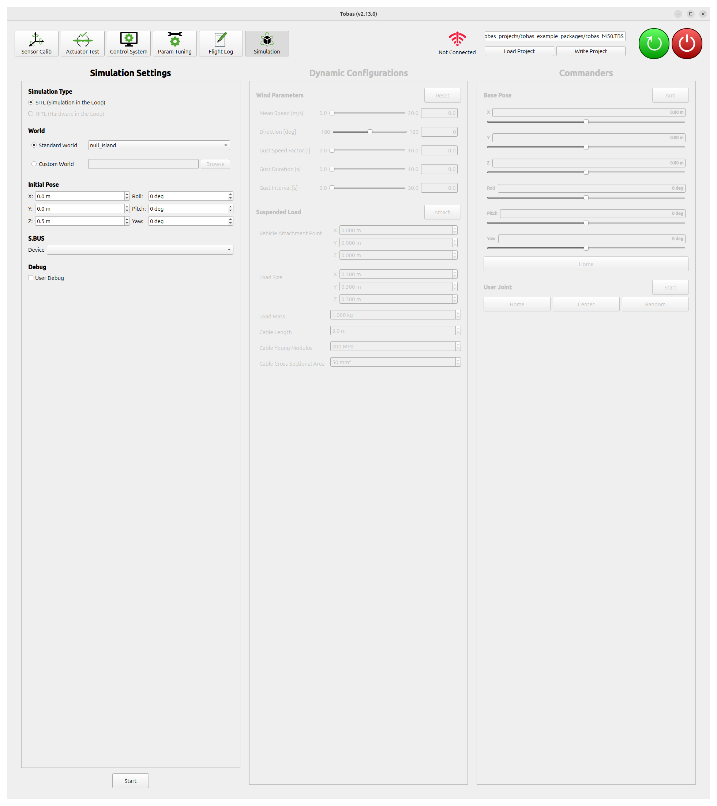
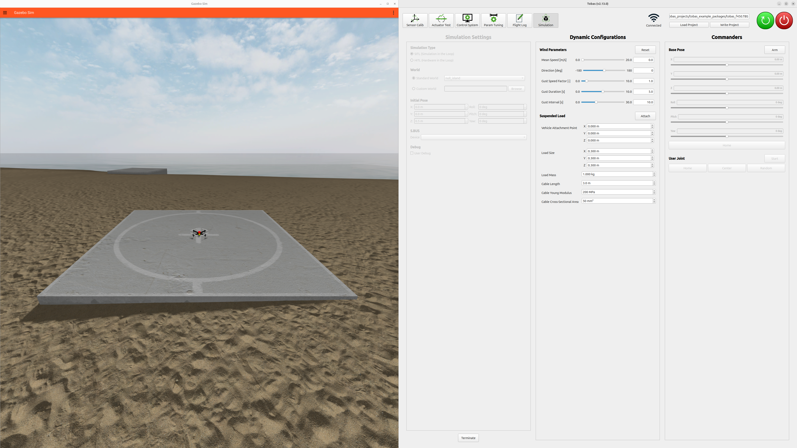
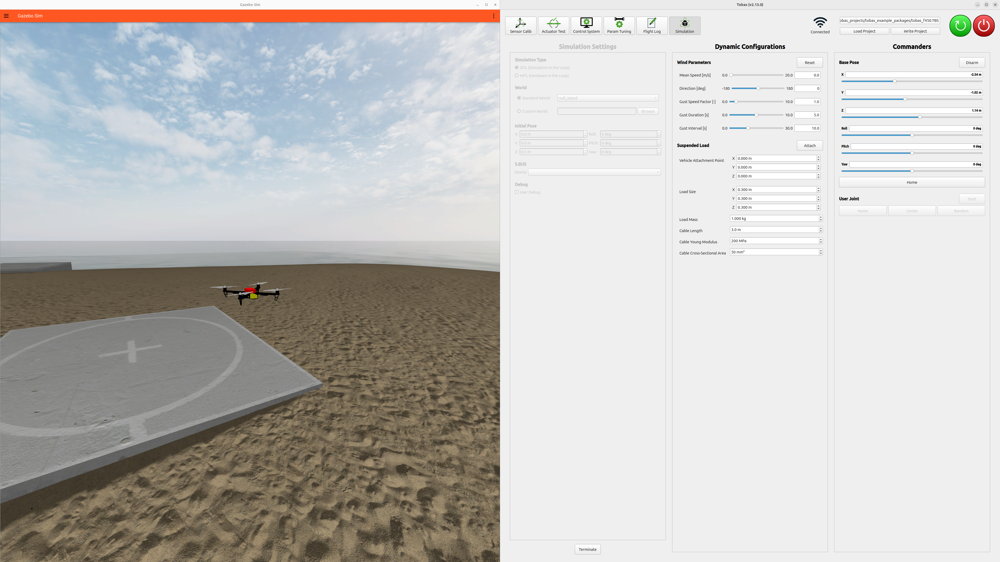
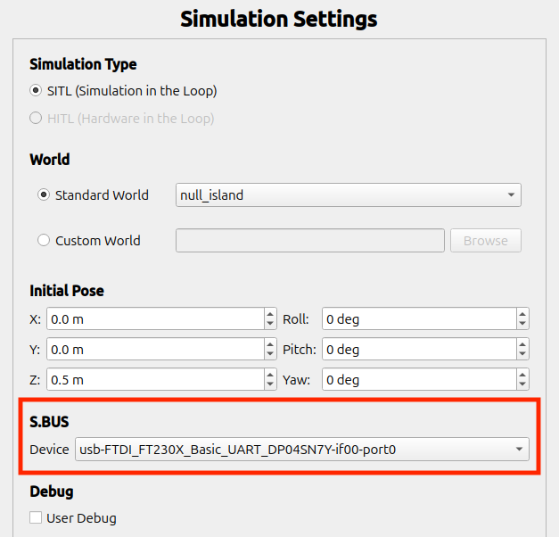

# シミュレーション

## 開始・終了の手順

---

Tobas GCS を起動して`tobas_f450.TBS`を読み込み，ツールボタンから`Simulation`を開きます．



`Start`をクリックすると，プロジェクトをビルドした後にシミュレーションが起動します．
初回は環境データのダウンロードのために時間がかかります．
環境の複雑さやネットワーク環境にも依りますが，長くとも10分以内には起動することが多いです．



`Dynamic Configurations`から風速などの環境設定，`Commanders`から機体への指令を行うことができます．
[Flight Test](./flight_test.md)で紹介したミッション計画やパラメータチューニングなども実機と同様に行うことができます．



`Terminate`をクリックするとシミュレーションが終了します．

## プロポでの操作

---

シミュレーション中の機体をプロポから操作することができます．
PC 内に保存された RC キャリブレーションの結果を使用するため，
ご使用の PC でキャリブレーションを済ませてから以下の手順に進んでください．

### USB シリアル変換モジュールの用意

<a href=https://akizukidenshi.com/catalog/g/g108461/ target="_blank">FTDI FT234X</a>
のような USB シリアル変換モジュールを用意し，High-Low を反転するよう設定してください．

### `dialout`グループへの追加

USB シリアルデバイスにアクセスするため，次のコマンドで現在のユーザを`dialout`グループに追加してください．

```bash
sudo usermod -aG dialout "${USER}"
```

設定を反映するため，コマンドの実行後に PC を再起動してください．
この操作が必要なのは初回のみで，2 回目以降は実行する必要はありません．

### シミュレーションを実行するたびに行う操作

1. USB シリアル変換モジュールを PC と RC 受信機に接続します．
1. `Simulation Settings`の`S.BUS/Device`の欄から使用しているデバイスを選択します．
1. シミュレーションを起動し，プロポの信号が`Control System`に表示されれば成功です．実機と同様に操作できます．



## ROS を介した操作

---

フライトコントローラを構成する各コンポーネント間の通信は全て ROS で行われているため，
ユーザは自分のプログラムから機体を操作することができます．
詳しくは[User Code (Python)](../for_developers/user_code_py.md)や[User Code (C++)](../for_developers/user_code_cpp.md)をご覧ください．
